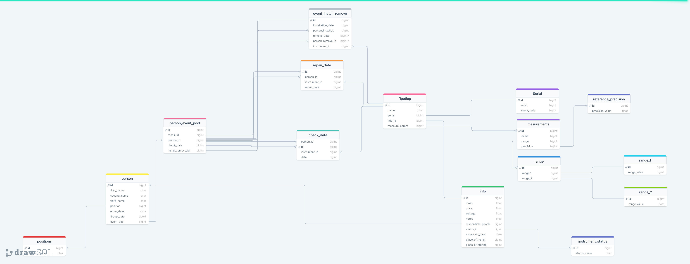

# kip-system

КИП система для курсового проекта СамГТУ

## Устновка приложения

```bash
cd shell-scripts
sudo chmod u+x install.sh
./install.sh
```

Установщик настроит python окружение, а также создаст daemon (Ubuntu 22.04).

Windows, Mac OS - настраивайте всё своими ручками :)

## Преднастройка окружения

В корне проекта `backend` нужно создать `.env` файл

Структура `.env`:

```bash
DB_HOST=localhost
DB_PORT=5430
DB_PASS=postgres
DB_USER=postgres
DB_NAME=postgres
SECRET=SECRET_KEY
```

По названию DB - настройки для подключения к базе данных Postgres, эти же параметры можно взять из `docker-compose.yml` файла или настроить их по своему желанию.

Secret отвечает за настройку ключа JWT.

Также в `src/config` имеется `config.ini` файл, которым выполняется настройка для запуска самого приложения

## Запуск приложения

```bash
systemctl start kip-system.service
```

## Даталогическая схема

[](https://drawsql.app/teams/nia/diagrams/kursovaya/embed)
